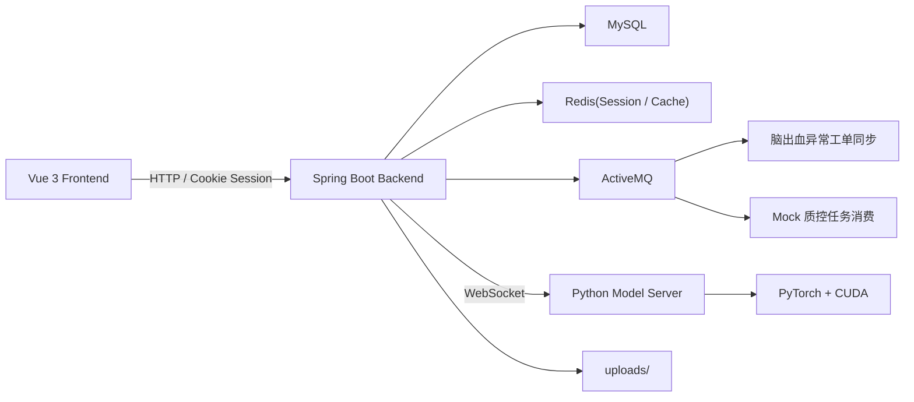

# Medical QC SYS

Medical QC SYS 是一个面向医学影像质控场景的前后端分离项目，当前聚焦于 CT 相关检查的质控工作流、异常工单管理，以及头部脑出血 AI 辅助分析。仓库由 `Spring Boot` 后端、`Vue 3 + Vite` 前端和一个嵌入式 `Python` 模型服务组成。

本仓库当前的实现状态可以概括为两类：

- 脑出血检测链路已经接入真实后端与 Python 推理服务，支持上传图片、模型推理、历史记录落库、异常工单生成和前端结果回显。
- 其余四个质控页面已经完成前后端页面、接口协议、异步任务投递与轮询流程，但检测结果仍然是 mock 数据，尚未接入真实算法。

## 1. 项目定位

项目目标不是单纯做一个“模型 demo”，而是围绕影像质控形成完整业务闭环：

- 医生/管理员登录与角色隔离
- 影像质控任务提交
- AI 或 mock 结果回显
- 历史记录与看板聚合
- 异常工单生成、处理与状态流转

当前系统更适合本地开发、课程设计、毕业设计、原型验证和功能演示。部分实现明显偏向 Windows 本地环境，尤其是 ActiveMQ 自动拉起与 Python 模型进程管理。

## 2. 当前功能范围

| 模块 | 状态 | 说明 |
| --- | --- | --- |
| 用户认证 | 已实现 | 支持注册、登录、登出、当前会话查询，采用 Session + Redis |
| 角色权限 | 已实现 | 角色分为 `admin` 和 `doctor`，前后端均有限制 |
| 首页仪表盘 | 已实现 | 展示欢迎信息、质控统计、趋势、风险预警、待办事项 |
| 脑出血检测 | 已实现 | 真实接入 Python WebSocket 模型服务，结果写入 `hemorrhage_records` |
| 脑出血历史 | 已实现 | 支持最近记录、按记录 ID 回显详情 |
| 异常汇总页 | 已实现 | 基于统一工单表 `qc_issue_records` 展示统计、趋势、列表和处理 |
| 管理员用户管理 | 已实现 | 支持用户分页查询、角色/状态更新 |
| CT 头部平扫 | 半实现 | 页面与异步任务流程已完成，结果仍为 mock |
| CT 胸部平扫 | 半实现 | 页面与异步任务流程已完成，结果仍为 mock |
| CT 胸部增强 | 半实现 | 页面与异步任务流程已完成，结果仍为 mock |
| 冠脉 CTA | 半实现 | 页面与异步任务流程已完成，结果仍为 mock |

## 3. 总体架构



### 3.1 后端职责

后端是整个系统的核心编排层，负责：

- 用户认证与角色校验
- 文件上传与静态资源映射
- 脑出血检测调用 Python 模型
- 质控历史记录入库
- 异常工单生成与状态流转
- 仪表盘和异常汇总的数据聚合
- ActiveMQ 消息生产与消费

### 3.2 Python 模型服务职责

Python 子模块运行在 `medical-qc-backend/python_model/` 下，以 WebSocket 服务形式提供推理能力：

- 启动文件：`model_server.py`
- 默认地址：`ws://localhost:8765`
- 当前模型：多任务 CNN
- 当前输出：出血判定、出血概率、中线偏移、脑室异常、耗时等

### 3.3 前端职责

前端负责：

- 登录注册
- 路由鉴权与角色页控制
- 影像质控页面交互
- 异步任务轮询
- 仪表盘、异常汇总的图表展示
- 报告导出和工单处理交互

## 4. 技术栈

### 4.1 后端

- Java 17
- Spring Boot 3.2.2
- Embedded Tomcat 10.1.52
- Log4j2
- MyBatis-Plus 3.5.5
- MySQL 8
- Redis
- Spring Session Data Redis
- Spring Cache
- ActiveMQ
- Java-WebSocket
- Maven 3.9.13

### 4.2 前端

- Vue 3
- Vite 7
- Vue Router 4
- Pinia 3
- Element Plus 2
- Axios
- ECharts 6
- ESLint 9
- Prettier 3
- `vue-tsc` / TypeScript 工具链

说明：前端源码主体目前仍以 `JavaScript` 为主，仓库中保留了 TypeScript 配置和类型检查能力，但不是一个完整的 TS-only 项目。

### 4.3 AI / Python

- Python 3.10+
- PyTorch
- TorchVision
- WebSockets
- OpenCV
- Pillow
- NumPy
- CUDA GPU 推理

## 5. 仓库结构

```text
Medical QC SYS/
├─ docs/
│  └─ dashboard-summary-data-model.md
├─ medical-qc-backend/
│  ├─ pom.xml
│  ├─ scripts/
│  │  └─ activemq.ps1
│  ├─ python_model/
│  │  ├─ model_server.py
│  │  ├─ train_advanced.py
│  │  ├─ train_hemorrhage_optimized.py
│  │  ├─ models/
│  │  └─ data/
│  ├─ src/main/java/com/medical/qc/
│  │  ├─ bean/
│  │  ├─ common/
│  │  ├─ config/
│  │  ├─ controller/
│  │  ├─ entity/
│  │  ├─ mapper/
│  │  ├─ messaging/
│  │  ├─ service/
│  │  └─ support/
│  ├─ src/main/resources/
│  │  ├─ application.properties
│  │  ├─ mapper/
│  │  └─ sql/
│  └─ uploads/
├─ medical-qc-frontend/
│  ├─ package.json
│  ├─ vite.config.js
│  ├─ public/
│  └─ src/
│     ├─ api/
│     ├─ assets/
│     ├─ components/
│     ├─ composables/
│     ├─ router/
│     ├─ stores/
│     ├─ utils/
│     └─ views/
├─ results/
├─ init.sql
```

### 5.1 根目录说明

- `init.sql`
  - 全量数据库初始化脚本，适合首次搭建数据库时执行。
- `docs/dashboard-summary-data-model.md`
  - 首页与异常汇总页的数据来源、表关系和扩展说明。
- `results/`
  - 更偏向训练实验或过程记录，不属于主运行链路必需目录。

### 5.2 后端分层说明

`medical-qc-backend/src/main/java/com/medical/qc/` 下的主要职责如下：

- `config/`
  - `PythonModelRunner`：后端启动后自动拉起 Python 模型服务
  - `ActiveMqRunner`：检测并按需拉起本机 ActiveMQ Broker，再启动 JMS 监听器
  - `DatabaseSchemaInitializer`：启动时补齐增量表和历史字段
  - `WebMvcConfig`：登录拦截器与 `/uploads/**` 静态映射
  - `RedisSessionConfig`：统一 Cookie Session 行为
- `controller/`
  - `AuthController`
  - `DashboardController`
  - `QualityController`
  - `SummaryController`
  - `AdminUserController`
- `service/impl/`
  - 业务核心实现层
- `messaging/`
  - ActiveMQ 生产者、消费者、消息体
- `entity/` / `mapper/`
  - MyBatis-Plus 实体与 Mapper
- `support/`
  - 业务辅助类，如角色校验、主异常项解析、mock 质控结果组装

### 5.3 前端目录说明

`medical-qc-frontend/src/` 的主要结构如下：

- `api/`
  - 后端接口封装，如认证、仪表盘、质控、异常汇总、管理接口
- `router/`
  - 路由定义与登录态/角色守卫
- `utils/`
  - Axios 封装、权限工具、用户状态缓存
- `composables/`
  - 异步质控页面复用逻辑，目前 `useAsyncQualityTaskPage.js` 被多个 mock 页面复用
- `views/auth/`
  - 登录、注册
- `views/dashboard/`
  - 首页仪表盘
- `views/quality/`
  - 质控页面，包括脑出血和四个 mock 页面
- `views/summary/`
  - 异常汇总与工单处理
- `views/admin/`
  - 用户管理

## 6. 页面与路由

当前前端核心路由如下：

| 路由 | 页面 | 权限 |
| --- | --- | --- |
| `/login` | 登录页 | 公开 |
| `/register` | 注册页 | 公开 |
| `/dashboard` | 首页仪表盘 | `doctor` / `admin` |
| `/head` | CT 头部平扫质控 | `doctor` |
| `/chest-non-contrast` | CT 胸部平扫 | `doctor` |
| `/chest-contrast` | CT 胸部增强 | `doctor` |
| `/coronary-cta` | 冠脉 CTA | `doctor` |
| `/hemorrhage` | 头部出血 AI 检测 | `doctor` |
| `/issues` | 异常汇总页 | `doctor` / `admin` |
| `/admin/users` | 用户管理 | `admin` |
| `/forbidden` | 无权限页 | 已登录用户 |

## 7. 核心业务流

### 7.1 脑出血检测真实链路

1. 前端在 `/hemorrhage` 页面上传位图图片和患者信息。
2. 后端 `QualityController` 接收文件。
3. `QualityServiceImpl` 将文件保存到 `medical-qc-backend/uploads/`。
4. 后端通过 WebSocket 连接 Python 模型服务 `ws://localhost:8765`。
5. Python 模型返回出血判定、概率、中线偏移、脑室异常等结果。
6. 后端将结果写入 `hemorrhage_records`。
7. 后端通过 `HemorrhageIssueSyncDispatcher` 同步或异步生成异常工单。
8. 前端回显分析结果，并可通过历史记录再次查看。

### 7.2 其余四个质控模块的异步任务链路

1. 前端提交质控任务到 `/api/v1/quality/*/detect`。
2. 后端创建 `taskId`，保存任务快照到内存 `ConcurrentHashMap`。
3. 后端优先投递到 ActiveMQ 队列。
4. 如果 MQ 不可用，则回退到本地线程池处理。
5. 前端轮询 `/api/v1/quality/tasks/{taskId}` 获取状态。
6. 当前消费者返回 mock 结果，页面完成回显。

注意：

- 当前 mock 任务结果不会落到数据库历史表。
- 任务快照是内存态的，后端重启后任务状态不会保留。
- 前端页面里有部分 DICOM/PACS 交互文案，但当前更多是模拟流程，不是真实 PACS/DICOM 解析链路。

## 8. 数据库设计

### 8.1 核心表

| 表名 | 作用 |
| --- | --- |
| `user_roles` | 角色字典，当前为 `admin`、`doctor` |
| `users` | 用户表 |
| `hemorrhage_records` | 脑出血检测历史记录 |
| `head_qc_records` | CT 头部平扫历史表，当前预建但未真实写入 |
| `chest_non_contrast_qc_records` | CT 胸部平扫历史表，当前预建但未真实写入 |
| `chest_contrast_qc_records` | CT 胸部增强历史表，当前预建但未真实写入 |
| `coronary_cta_qc_records` | 冠脉 CTA 历史表，当前预建但未真实写入 |
| `qc_issue_records` | 统一异常工单表 |
| `qc_issue_handle_logs` | 工单处理日志 |

### 8.2 当前真实落库情况

- 已真实写入：
  - `users`
  - `hemorrhage_records`
  - `qc_issue_records`
  - `qc_issue_handle_logs`
- 已建表但当前主流程未真实写入：
  - `head_qc_records`
  - `chest_non_contrast_qc_records`
  - `chest_contrast_qc_records`
  - `coronary_cta_qc_records`

### 8.3 初始化策略

数据库初始化有两层：

- 首次部署建议直接执行根目录 `init.sql`
- 后端启动时还会通过 `DatabaseSchemaInitializer` 自动补齐：
  - 用户和角色表
  - 脑出血历史表新增字段
  - 异常汇总相关历史表与工单表

也就是说，`init.sql` 适合“全量初始化”，而 Java 启动时的 schema initializer 更像“增量容错”。

## 9. 后端 API 概览

### 9.1 认证

- `POST /api/v1/auth/login`
- `POST /api/v1/auth/logout`
- `GET /api/v1/auth/current`
- `POST /api/v1/auth/register`

### 9.2 仪表盘

- `GET /api/v1/dashboard/overview`
- `GET /api/v1/dashboard/trend`

### 9.3 质控

- `POST /api/v1/quality/hemorrhage`
- `GET /api/v1/quality/hemorrhage/history`
- `GET /api/v1/quality/hemorrhage/history/{recordId}`
- `POST /api/v1/quality/head/detect`
- `POST /api/v1/quality/chest-non-contrast/detect`
- `POST /api/v1/quality/chest-contrast/detect`
- `POST /api/v1/quality/coronary-cta/detect`
- `GET /api/v1/quality/tasks/{taskId}`

### 9.4 异常汇总

- `GET /api/v1/summary/stats`
- `GET /api/v1/summary/trend`
- `GET /api/v1/summary/distribution`
- `GET /api/v1/summary/recent`
- `GET /api/v1/summary/issues/{issueId}`
- `PATCH /api/v1/summary/issues/{issueId}/status`

### 9.5 管理端

- `GET /api/v1/admin/users`
- `PATCH /api/v1/admin/users/{userId}`
- `PUT /api/v1/admin/users/{userId}`

## 10. 运行环境要求

推荐按当前代码默认行为准备环境：

- 操作系统：Windows 优先
- JDK：17，当前统一安装路径为 `D:\JDK17`
- Maven：3.9.13，当前统一安装路径为 `E:\Maven\apache-maven-3.9.13`
- Maven 本地仓库：`E:\Maven\maven_jar`
- Node.js：`^20.19.0` 或 `>=22.12.0`，当前本机已验证版本为 `v24.13.0`
- npm：当前本机已验证版本为 `11.6.2`
- Tomcat：10.1.52（可选独立运行环境，当前目录为 `D:\Apache Tomcat\apache-tomcat-10.1.52`）
- Python：3.10+，推荐优先使用项目根目录下的 `.venv`
- MySQL：8.0+
- Redis：6.0+
- ActiveMQ：5.16.6+
- GPU：NVIDIA CUDA 环境

### 10.1 为什么建议 Windows

因为当前代码中有明显的本地 Windows 约定：

- `app.messaging.activemq.home` 默认是 Windows 路径
- `scripts/activemq.ps1` 是 PowerShell 脚本
- ActiveMQ 自动拉起调用的是 `activemq.bat`
- Python 解释器自动探测优先找 `.venv\\Scripts\\python.exe`

### 10.2 Java / Maven / Tomcat 运行约定

- 机器级与用户级 `JAVA_HOME` / `JDK_HOME` 当前统一指向 `D:\JDK17`，后端构建与运行均按 JDK 17 执行。
- 机器级与用户级 `MAVEN_HOME` / `M2_HOME` 当前统一指向 `E:\Maven\apache-maven-3.9.13`，本机唯一 Maven 本地仓库为 `E:\Maven\maven_jar`。
- 后端默认以 `Spring Boot` 内嵌 Tomcat 模式运行，直接执行 `mvn spring-boot:run` 即可，不需要手工部署到外部 Tomcat。
- 如需保留独立 Tomcat 运行环境，当前统一目录为 `D:\Apache Tomcat\apache-tomcat-10.1.52`，并对应 `CATALINA_HOME` / `CATALINA_BASE` / `TOMCAT_HOME`。

## 11. 关键配置

关键配置位于：

- `medical-qc-backend/src/main/resources/application.properties`
- `medical-qc-backend/src/main/resources/log4j2-spring.xml`
- `medical-qc-frontend/.env.development`
- `medical-qc-frontend/vite.config.js`

### 11.1 后端默认配置项

当前后端默认配置包括：

- 服务端口：`8080`
- MySQL：`medical_qc_sys`
- Redis：`localhost:6379`
- Session 存储：Redis
- ActiveMQ：`tcp://127.0.0.1:61616`
- Python 模型地址：`ws://localhost:8765`
- Python 模型自动启动：`true`
- ActiveMQ 自动启动：`true`
- 日志实现：Log4j2，日志文件默认输出到 `medical-qc-backend/logs/medical-qc-backend.log`

### 11.2 需要重点修改的配置

至少建议检查以下内容：

```properties
spring.datasource.url=jdbc:mysql://localhost:3306/medical_qc_sys?useSSL=false&serverTimezone=UTC&allowPublicKeyRetrieval=true
spring.datasource.username=root
spring.datasource.password=123456

spring.data.redis.host=localhost
spring.data.redis.port=6379

spring.activemq.broker-url=tcp://127.0.0.1:61616
spring.activemq.user=admin
spring.activemq.password=admin

app.messaging.activemq.home=D:/activemq/apache-activemq-5.16.6-bin/apache-activemq-5.16.6

python.model_server.url=ws://localhost:8765
python.model.autostart=true
python.executable=
```

说明：

- `python.executable` 为空时，后端会尝试自动寻找根目录或上级目录中的 `.venv`。
- 如果本机没有安装 ActiveMQ，或路径不同，必须修改 `app.messaging.activemq.home`。
- 当前 Session 强依赖 Redis，Redis 不可用时登录态会有问题。

## 12. 快速开始

### 12.1 初始化数据库

1. 创建数据库：

```sql
CREATE DATABASE medical_qc_sys;
```

2. 执行根目录 `init.sql`。

3. 修改后端数据库连接配置。

### 12.2 准备 Redis

启动本地 Redis，默认端口 `6379`。

### 12.3 准备 ActiveMQ

方式一：手动启动

```powershell
cd medical-qc-backend
powershell -ExecutionPolicy Bypass -File .\scripts\activemq.ps1 -Action start
```

方式二：依赖后端自动拉起

- 前提是 `app.messaging.activemq.autostart=true`
- 且 `app.messaging.activemq.home` 指向正确安装目录

### 12.4 准备 Python 环境

当前仓库没有现成的 `requirements.txt`，需要按实际依赖手动安装。

建议先创建并激活虚拟环境，然后安装：

```powershell
cd F:\Medical QC SYS
python -m venv .venv
.\.venv\Scripts\Activate.ps1
pip install websockets opencv-python pillow numpy
```

PyTorch 需要根据你本机 CUDA 版本安装与之匹配的版本，建议参考 PyTorch 官方说明后安装，例如：

```powershell
pip install torch torchvision
```

如果你要运行脑出血真实检测，还需要确认以下文件存在：

- `medical-qc-backend/python_model/models/hemorrhage_model_advanced.pth`

### 12.5 启动后端

```powershell
cd medical-qc-backend
mvn spring-boot:run
```

后端启动后会尝试做三件事：

- 检测并补齐数据库增量结构
- 检测并启动 ActiveMQ Broker
- 检测并启动 Python 模型服务

默认访问：

- 后端 API：`http://localhost:8080`
- Python WebSocket：`ws://localhost:8765`

### 12.6 启动前端

```powershell
cd medical-qc-frontend
npm install
npm run dev
```

默认访问：

- 前端开发地址：`http://localhost:5173`

Vite 已配置代理：

- `/api/v1` -> `http://localhost:8080`
- `/static` -> `http://localhost:8080`
- `/uploads` -> `http://localhost:8080`

## 13. 常用开发命令

### 13.1 后端

```powershell
cd medical-qc-backend
mvn spring-boot:run
mvn clean package
mvn test
```

### 13.2 前端

```powershell
cd medical-qc-frontend
npm install
npm run dev
npm run build
npm run preview
npm run lint
npm run type-check
```

## 14. 当前实现中的几个重要事实

这部分非常重要，建议开发前先看完。

### 14.1 脑出血检测只支持位图图片

后端 `QualityServiceImpl` 当前明确限制脑出血检测上传格式为：

- `.png`
- `.jpg`
- `.jpeg`
- `.bmp`

不支持：

- `.dcm`
- DICOM 序列文件夹

虽然部分前端页面文案会提到 DICOM / PACS，但对脑出血真实链路来说，当前并未接入 DICOM 解析。

### 14.2 Python 模型当前要求 CUDA

`python_model/model_server.py` 在启动时会直接检查 `torch.cuda.is_available()`，如果 CUDA 不可用会抛异常。

这意味着：

- 没有 GPU / CUDA 时，脑出血真实检测功能不可用
- 但你仍然可以开发登录、管理、仪表盘、异常汇总和四个 mock 模块

如果只是开发非脑出血功能，可以考虑在本地将：

```properties
python.model.autostart=false
```

### 14.3 其余四个质控模块仍是 mock

当前以下页面虽然已经具备“提交任务 -> 轮询 -> 回显结果”的完整交互链路：

- `/head`
- `/chest-non-contrast`
- `/chest-contrast`
- `/coronary-cta`

但后端消费者中仍然通过 `MockQualityAnalysisSupport` 生成假数据，不是真实 AI 推理结果。

### 14.4 Mock 任务状态不持久化

`MockQualityTaskServiceImpl` 使用内存 `ConcurrentHashMap` 存任务状态，因此：

- 后端重启后任务会丢失
- 当前不适合分布式部署
- 更适合本地调试或原型演示

### 14.5 ActiveMQ 不是绝对阻塞点

当前代码对 MQ 做了降级处理：

- 脑出血异常工单同步：MQ 不可用时会回退为同步生成
- 其余四个 mock 任务：MQ 不可用时会回退到本地线程池执行

所以即使没有完全跑通 ActiveMQ，系统大部分页面仍然可以工作，只是异步消息链路不再经过 Broker。

## 15. 推荐阅读顺序

如果你准备继续开发这个项目，建议按下面的顺序阅读代码：

1. `README.md`
2. `docs/dashboard-summary-data-model.md`
3. `medical-qc-backend/src/main/resources/application.properties`
4. `medical-qc-backend/src/main/java/com/medical/qc/controller/`
5. `medical-qc-backend/src/main/java/com/medical/qc/service/impl/`
6. `medical-qc-backend/src/main/java/com/medical/qc/messaging/`
7. `medical-qc-backend/python_model/model_server.py`
8. `medical-qc-frontend/src/router/index.js`
9. `medical-qc-frontend/src/api/`
10. `medical-qc-frontend/src/views/`

## 16. 后续可扩展方向

从当前架构出发，比较自然的下一步包括：

- 为其余四个质控模块接入真实算法服务
- 将 mock 任务快照从内存迁移到 Redis 或数据库
- 为脑出血检测接入 DICOM 解析与序列级推理
- 将工单统一来源从“仅脑出血”扩展到所有质控模块
- 将 ActiveMQ、MySQL、Redis、Python 服务容器化
- 为前端补齐更完整的 TypeScript 化与组件抽象

## 17. 总结

这个项目当前最有价值的部分，是它已经不是单点算法调用，而是形成了一个相对完整的业务骨架：

- 前端页面成型
- 后端接口分层清晰
- 数据表设计已经考虑扩展
- 脑出血真实链路已经跑通
- 其他质控模块的异步协议也已经铺好

如果后续继续迭代，最优路径不是推倒重来，而是在现有架构上逐步把 mock 模块替换成真实能力。
