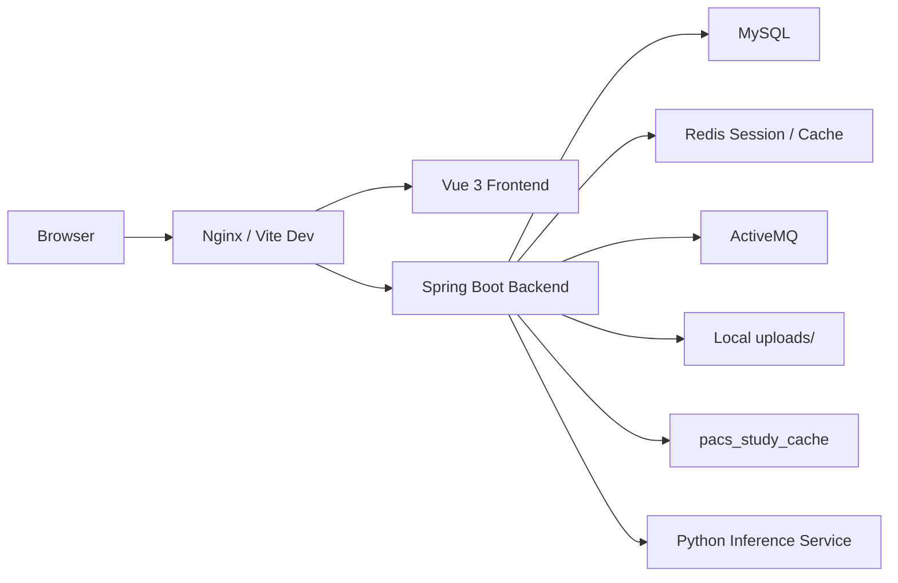

# Medical QC SYS

Medical QC SYS 是一个面向医学影像质控场景的前后端分离项目，当前由 `Spring Boot` 后端、`Vue 3` 前端和独立 Python 推理服务组成。系统围绕统一质控模型组织任务、结果、异常工单、患者信息和规则配置，当前唯一真实接入 AI 推理的链路为头部出血检测。

## 项目概览



## 当前能力

| 模块 | 状态 | 说明 |
| --- | --- | --- |
| 登录注册与权限 | 已实现 | 支持管理员、医生两类角色，会话存储基于 Redis |
| 仪表盘 | 已实现 | 展示趋势、风险预警、待办事项和快捷入口 |
| 头部出血检测 | 已实现 | 接入 Python WebSocket 推理服务，结果写入统一模型 |
| 其他质控任务 | 已实现 | 头部平扫、胸部平扫、胸部增强、冠脉 CTA 走统一任务中心 |
| 患者信息管理 | 已实现 | 五类任务共享统一患者和检查模型 |
| PACS 查询 | 已实现 | 基于缓存表检索检查记录并补齐主数据 |
| 异常工单 | 已实现 | 支持统计、详情、状态流转和 CAPA |
| 规则中心 | 已实现 | 支持维护优先级、责任角色、SLA 和自动建单策略 |

说明：

- `hemorrhage` 为当前真实 AI 检测链路。
- `head`、`chest-non-contrast`、`chest-contrast`、`coronary-cta` 当前统一走任务模型，但分析结果以 mock 数据为主。

## 技术栈

### 后端

- Java 17
- Spring Boot 3.2.2
- MyBatis-Plus 3.5.5
- Flyway
- MySQL 8
- Redis + Spring Session
- ActiveMQ
- Log4j2

### 前端

- Vue 3
- Vue Router 4
- Pinia 3
- Element Plus 2
- ECharts 6
- Vite 7

### Python 推理服务

- Python 3.10+
- WebSocket
- PyTorch / TorchVision
- OpenCV / Pillow / NumPy

## 仓库结构

```text
Medical QC SYS/
├─ deploy/                    # 反向代理与部署骨架
├─ docs/                      # 项目文档中心
├─ medical-qc-backend/        # Spring Boot 后端
│  ├─ python_model/           # Python 推理与训练脚本
│  ├─ scripts/                # 后端辅助脚本
│  └─ src/
├─ medical-qc-frontend/       # Vue 3 前端
│  ├─ scripts/                # 前端启动脚本
│  └─ src/
└─ README.md
```

## 快速开始

### 1. 环境准备

- MySQL 8+
- Redis 6+
- ActiveMQ 5.16+
- Python 3.10+
- Node.js `^20.19.0 || >=22.12.0`
- JDK 17
- Maven 3.9+

### 2. 创建数据库

```sql
CREATE DATABASE medical_qc_sys_unified CHARACTER SET utf8mb4 COLLATE utf8mb4_0900_ai_ci;
```

Flyway 首次启动时会自动执行基线脚本。

### 3. 启动后端

```powershell
cd medical-qc-backend
mvn spring-boot:run
```

默认端口：`http://localhost:8080`

### 4. 启动前端

```powershell
cd medical-qc-frontend
npm install
npm run dev
```

默认端口：`http://localhost:5173`

## 常用命令

### 后端

```powershell
cd medical-qc-backend
mvn spring-boot:run
mvn clean test
mvn clean package
```

### 前端

```powershell
cd medical-qc-frontend
npm run dev
npm run build
npm run preview
npm run lint
npm run type-check
```

## 数据库与运行约束

- 运行库固定为 `medical_qc_sys_unified`
- Flyway 基线位于 `medical-qc-backend/src/main/resources/db/baseline`
- 上传目录使用本地 `uploads/`
- `dev` 环境允许自动拉起本地 Python 和 ActiveMQ
- `prod` 环境默认禁止自动拉起外部进程

## 文档导航

- 文档索引：`docs/README.md`
- 项目架构文档：`docs/project-documentation.md`
- 开发文档：`docs/development-guide.md`
- 功能介绍：`docs/feature-overview.md`
- 使用说明：`docs/user-guide.md`
- 生产部署说明：`docs/deployment-production.md`
- 部署骨架说明：`deploy/README.md`
- 前端子项目说明：`medical-qc-frontend/README.md`
