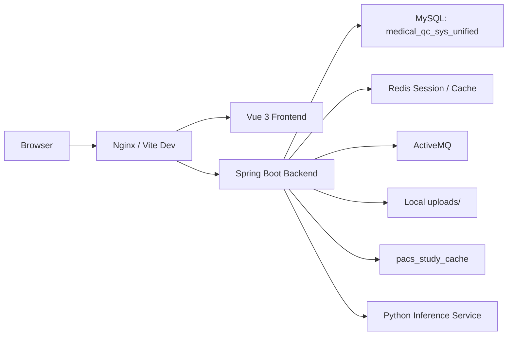

# Medical QC SYS

Medical QC SYS 是一个面向医学影像质控场景的前后端分离项目，当前由 `Spring Boot` 后端、`Vue 3` 前端和一个独立的 Python 推理服务组成。系统已经完成统一模型落地，默认运行数据库为 `medical_qc_sys_unified`。

## 当前架构



## 功能概览

| 模块 | 当前状态 | 说明 |
| --- | --- | --- |
| 认证与权限 | 已实现 | 支持登录、注册、会话查询、管理员/医生角色隔离 |
| 仪表盘 | 已实现 | 展示质控趋势、风险预警、待办事项和最近动态 |
| 头部出血检测 | 已实现 | 真实接入 Python WebSocket 推理服务，结果写入统一模型 |
| 异步质控任务 | 已实现 | 头部平扫、胸部平扫、胸部增强、冠脉 CTA 统一走任务中心 |
| 患者信息管理 | 已实现 | 五类任务共享统一患者/检查模型 |
| PACS 查询 | 已实现 | 基于 `pacs_study_cache` 查询并补齐统一患者主数据 |
| 异常工单 | 已实现 | 支持异常统计、详情、流转日志和 CAPA |
| 规则中心 | 已实现 | 管理任务类型、异常项、优先级、责任角色和 SLA |

说明：

- 头部出血检测当前走真实 AI 推理链路。
- 其余四类质控任务当前仍通过统一任务模型返回 mock 结果，但写入、查询和工单流程已经统一。

## 仓库结构

```text
Medical QC SYS/
├─ deploy/
│  ├─ README.md
│  └─ nginx/
│     └─ medical-qc.conf
├─ docs/
│  ├─ deployment-production.md
│  └─ project-documentation.md
├─ medical-qc-backend/
│  ├─ pom.xml
│  ├─ python_model/
│  └─ src/
│     ├─ main/
│     │  ├─ java/com/medical/qc/
│     │  │  ├─ bean/
│     │  │  ├─ common/
│     │  │  ├─ config/
│     │  │  ├─ messaging/
│     │  │  ├─ modules/
│     │  │  ├─ shared/
│     │  │  └─ support/
│     │  └─ resources/
│     │     ├─ application.properties
│     │     ├─ application-dev.properties
│     │     ├─ application-prod.properties
│     │     ├─ db/baseline/
│     │     └─ mapper/
│     └─ test/
├─ medical-qc-frontend/
│  ├─ package.json
│  └─ src/
│     ├─ app/
│     ├─ assets/
│     ├─ components/
│     ├─ composables/
│     ├─ modules/
│     └─ utils/
└─ .venv/
```

## 技术栈

### 后端

- Java 17
- Spring Boot 3.2.2
- MyBatis-Plus 3.5.5
- Flyway
- MySQL 8
- Redis + Spring Session
- ActiveMQ
- Log4j2

### 前端

- Vue 3
- Vue Router 4
- Pinia 3
- Element Plus 2
- ECharts 6
- Vite 7

### 推理服务

- Python 3.10+
- WebSocket 服务
- PyTorch / TorchVision
- OpenCV / Pillow / NumPy

## 数据库与迁移

- 运行库：`medical_qc_sys_unified`
- Flyway 位置：`medical-qc-backend/src/main/resources/db/baseline`
- 当前基线脚本：`V7__create_unified_schema_baseline.sql`

核心表包括：

- `users` / `user_roles`
- `patients` / `studies` / `study_files`
- `qc_task_types` / `qc_tasks` / `qc_results` / `qc_result_items`
- `issue_tickets` / `issue_action_logs` / `issue_capa_records`
- `qc_rules`
- `pacs_study_cache`

## 快速开始

### 1. 准备依赖

- MySQL 8+
- Redis 6+
- ActiveMQ 5.16+
- Python 3.10+
- Node.js `^20.19.0 || >=22.12.0`
- JDK 17
- Maven 3.9+

### 2. 创建数据库

```sql
CREATE DATABASE medical_qc_sys_unified CHARACTER SET utf8mb4 COLLATE utf8mb4_0900_ai_ci;
```

应用首次启动时会通过 Flyway 自动初始化表结构。

### 3. 启动后端

```powershell
cd medical-qc-backend
mvn spring-boot:run
```

默认配置见：

- `medical-qc-backend/src/main/resources/application.properties`
- `medical-qc-backend/src/main/resources/application-dev.properties`
- `medical-qc-backend/src/main/resources/application-prod.properties`

### 4. 启动前端

```powershell
cd medical-qc-frontend
npm install
npm run dev
```

默认访问地址：

- 前端：`http://localhost:5173`
- 后端：`http://localhost:8080`

## 常用命令

### 后端

```powershell
cd medical-qc-backend
mvn spring-boot:run
mvn clean test
mvn clean package
```

### 前端

```powershell
cd medical-qc-frontend
npm run dev
npm run build
npm run preview
npm run lint
npm run type-check
```

## 当前开发约束

- 数据库结构变更只通过 Flyway 基线后续版本追加，不再维护旧架构迁移脚本。
- 统一模型是唯一运行路径，不再保留旧库回退方案。
- `dev` 环境允许自动拉起本地 Python 和 ActiveMQ；`prod` 环境默认禁止。
- `uploads/` 属于当前运行数据目录，不应按旧架构残留处理。

## 文档

- 项目总文档：`docs/project-documentation.md`
- 生产部署说明：`docs/deployment-production.md`
- 部署骨架说明：`deploy/README.md`
