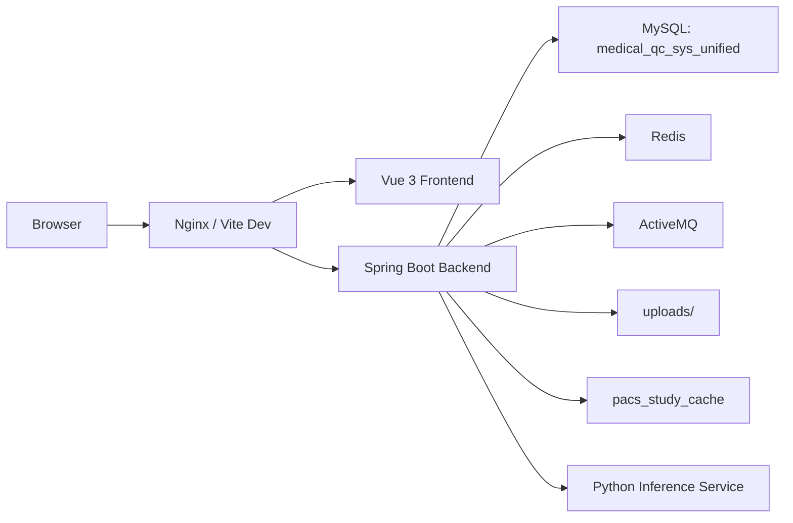

# Medical QC SYS 项目架构文档

更新时间：2026-03-13

## 1. 文档定位

本文件只负责说明项目的当前架构、模块边界、核心数据模型和运行依赖，不重复展开开发步骤、业务操作步骤或部署命令。

相关文档入口：

- 开发文档：`docs/development-guide.md`
- 功能介绍：`docs/feature-overview.md`
- 使用说明：`docs/user-guide.md`
- 部署说明：`docs/deployment-production.md`

## 2. 项目目标

Medical QC SYS 用于承接医学影像质控流程中的关键环节，包括：

- 任务提交与结果回收
- 患者与检查主数据管理
- PACS 缓存记录查询
- 异常建单与处置流转
- 规则配置与治理

当前系统采用统一模型作为唯一运行路径，不再维护旧库兼容方案。

## 3. 总体架构

## 4. 子系统职责

### 4.1 前端

前端负责：

- 登录注册与路由守卫
- 医生、管理员两类菜单与页面权限隔离
- 质控任务提交、查询和结果展示
- 患者信息维护与 PACS 记录选择
- 异常工单查看与处理
- 规则中心和用户管理

### 4.2 后端

后端负责：

- 用户认证、角色鉴权、会话管理
- 患者、检查、任务、结果和工单统一读写
- PACS 缓存检索与主数据同步
- 规则查询、自动建单、异常流转
- 对接 ActiveMQ 和 Python WebSocket 推理服务

### 4.3 Python 推理服务

Python 服务负责：

- 接收头部出血检测请求
- 执行模型推理
- 返回结构化推理结果

## 5. 后端结构

路径：`medical-qc-backend/src/main/java/com/medical/qc`

### 5.1 一级目录

| 目录 | 作用 |
| --- | --- |
| `bean` | 请求体与基础对象 |
| `common` | 通用常量、枚举、异常等 |
| `config` | Spring 配置与基础设施装配 |
| `messaging` | 消息相关实现 |
| `modules` | 业务模块 |
| `shared` | AI、消息、存储等共享能力 |
| `support` | 会话、任务类型、组装逻辑等辅助类 |

### 5.2 业务模块

| 模块 | 作用 |
| --- | --- |
| `modules/auth` | 登录、注册、当前用户 |
| `modules/adminuser` | 管理员用户管理 |
| `modules/dashboard` | 仪表盘聚合查询 |
| `modules/issue` | 异常统计、详情和流转 |
| `modules/pacs` | PACS 缓存查询 |
| `modules/patient` | 患者信息管理 |
| `modules/qcresult` | 头部出血检测记录 |
| `modules/qcrule` | 规则中心 |
| `modules/qctask` | 统一质控任务中心 |
| `modules/unified` | 统一数据模型支撑 |

### 5.3 关键接口分组

| 接口前缀 | 用途 |
| --- | --- |
| `/api/v1/auth` | 认证与当前用户 |
| `/api/v1/dashboard` | 仪表盘概览与趋势 |
| `/api/v1/quality` | 质控任务、头部出血检测、历史记录 |
| `/api/v1/patient-info` | 患者信息管理 |
| `/api/v1/pacs` | PACS 记录查询 |
| `/api/v1/summary` | 异常汇总与工单流转 |
| `/api/v1/admin/users` | 管理员用户管理 |
| `/api/v1/admin/qc-rules` | 规则中心 |

## 6. 前端结构

路径：`medical-qc-frontend/src`

### 6.1 一级目录

| 目录 | 作用 |
| --- | --- |
| `app` | 应用入口、路由、全局装配 |
| `assets` | 样式与静态资源 |
| `components` | 通用组件 |
| `composables` | 复用逻辑 |
| `modules` | 页面级业务模块 |
| `utils` | 工具方法、权限与认证辅助 |

### 6.2 页面模块

| 模块 | 作用 |
| --- | --- |
| `modules/auth` | 登录与注册 |
| `modules/app-shell` | 主布局与无权限页 |
| `modules/dashboard` | 仪表盘 |
| `modules/qctask` | 五类质控任务与任务中心 |
| `modules/patient` | 患者信息管理 |
| `modules/issue` | 异常汇总与工单详情 |
| `modules/admin-user` | 用户管理 |
| `modules/qcrule` | 规则中心 |

### 6.3 路由组

| 路由文件 | 内容 |
| --- | --- |
| `app/router/routes/publicRoutes.js` | 登录、注册、无权限页 |
| `app/router/routes/qualityRoutes.js` | 仪表盘、质控任务、任务中心 |
| `app/router/routes/patientRoutes.js` | 五类患者信息管理页 |
| `app/router/routes/issueRoutes.js` | 异常汇总 |
| `app/router/routes/adminRoutes.js` | 用户管理、规则中心 |

## 7. 核心数据模型

### 7.1 运行库

- 数据库：`medical_qc_sys_unified`
- Flyway 目录：`classpath:db/baseline`
- 当前基线：`V7__create_unified_schema_baseline.sql`

### 7.2 核心表

| 领域 | 表名 |
| --- | --- |
| 用户与角色 | `user_roles`, `users` |
| 患者与检查 | `patients`, `studies`, `study_files` |
| 任务与结果 | `qc_task_types`, `qc_tasks`, `qc_results`, `qc_result_items` |
| 异常工单 | `issue_tickets`, `issue_action_logs`, `issue_capa_records` |
| 配置与缓存 | `qc_rules`, `pacs_study_cache` |

### 7.3 模型关系

核心链路如下：

1. 患者信息写入 `patients`
2. 检查实例写入 `studies`
3. 文件资源写入 `study_files`
4. 质控任务写入 `qc_tasks`
5. 结果摘要与明细写入 `qc_results`、`qc_result_items`
6. 异常根据规则生成 `issue_tickets`
7. 流转记录和 CAPA 写入 `issue_action_logs`、`issue_capa_records`

## 8. 关键运行配置

路径：`medical-qc-backend/src/main/resources`

| 配置项 | 默认值 | 说明 |
| --- | --- | --- |
| `server.port` | `8080` | 后端端口 |
| `spring.datasource.url` | `jdbc:mysql://localhost:3306/medical_qc_sys_unified...` | MySQL 连接 |
| `spring.data.redis.host` | `localhost` | Redis 地址 |
| `spring.activemq.broker-url` | `tcp://127.0.0.1:61616` | ActiveMQ 地址 |
| `python.model_server.url` | `ws://localhost:8765` | Python 推理服务 |
| `app.storage.local.root` | `uploads` | 文件上传目录 |

环境差异：

- `application.properties`：通用默认配置
- `application-dev.properties`：开发环境可自动拉起 Python 和 ActiveMQ
- `application-prod.properties`：生产环境禁止自动拉起外部进程

## 9. 当前实现边界

- 头部出血检测是当前唯一真实 AI 推理链路
- 其余四类任务目前仍以 mock 结果驱动统一任务中心
- PACS 当前基于缓存表，不是直接对接 DICOM 网关
- 会话依赖 Redis，未使用无状态 JWT 模式

## 10. 文档维护原则

- 根 `README.md` 只承担项目入口和快速启动职责
- `docs/project-documentation.md` 只描述当前架构
- 开发、功能、使用、部署文档各自独立，不互相重复
- 发现模板文档或过期文档时，优先重写；无保留价值时再删除
