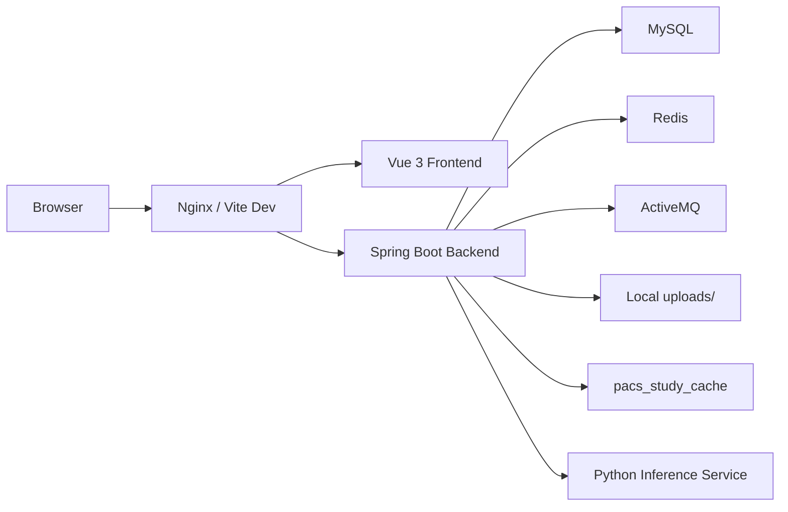

# Medical QC SYS 项目文档

更新时间：2026-03-13

## 1. 项目定位

Medical QC SYS 是一个围绕医学影像质控流程构建的业务系统，目标不是单点模型演示，而是把任务提交、结果落库、异常建单、患者信息维护、PACS 查询和后台治理统一到同一套业务模型中。

当前系统已经完成统一模型落地，运行主路径固定为：

- 单一运行库：`medical_qc_sys_unified`
- 后端形态：模块化单体
- 前端形态：模块化单页应用
- 推理方式：Python WebSocket 服务

## 2. 总体架构



### 2.1 后端职责

- 认证、鉴权、会话管理
- 统一患者、检查、任务、结果、工单读写
- PACS 缓存检索与患者主数据补齐
- 规则中心与管理员操作
- 对接 ActiveMQ 与 Python 推理服务

### 2.2 前端职责

- 登录、注册、路由守卫与角色菜单
- 仪表盘、任务中心、患者信息、工单和规则中心页面
- PACS 查询弹窗与患者档案联动
- 图表可视化与任务结果展示

### 2.3 Python 服务职责

- 提供头部出血检测推理接口
- 通过 WebSocket 返回结构化推理结果
- 被后端作为 `AiGateway` 调用

## 3. 后端结构

路径：`medical-qc-backend/src/main/java/com/medical/qc`

### 3.1 一级目录

- `bean`
- `common`
- `config`
- `messaging`
- `modules`
- `shared`
- `support`

### 3.2 模块划分

| 模块 | 作用 |
| --- | --- |
| `modules/auth` | 登录、注册、当前用户 |
| `modules/adminuser` | 管理员用户管理 |
| `modules/dashboard` | 仪表盘聚合查询 |
| `modules/issue` | 异常工单统计、详情和流转 |
| `modules/pacs` | PACS 缓存查询 |
| `modules/patient` | 患者信息管理 |
| `modules/qcresult` | 头部出血检测结果相关能力 |
| `modules/qcrule` | 规则中心 |
| `modules/qctask` | 统一任务中心与异步任务查询 |
| `modules/unified` | 统一模型读写与跨模块查询支撑 |

### 3.3 公共基础设施

| 路径 | 作用 |
| --- | --- |
| `shared/ai` | AI 网关抽象与 Python WebSocket 实现 |
| `shared/messaging` | 消息总线抽象与 ActiveMQ 实现 |
| `shared/storage` | 文件存储抽象与本地存储实现 |
| `support` | 任务类型、会话用户、结果组装等辅助逻辑 |

## 4. 前端结构

路径：`medical-qc-frontend/src`

### 4.1 一级目录

- `app`
- `assets`
- `components`
- `composables`
- `modules`
- `utils`

### 4.2 模块划分

| 模块 | 作用 |
| --- | --- |
| `modules/auth` | 登录与注册页面 |
| `modules/app-shell` | 主布局与无权限页 |
| `modules/dashboard` | 仪表盘 |
| `modules/issue` | 异常汇总与处理 |
| `modules/patient` | 患者信息管理 |
| `modules/qcrule` | 规则中心 |
| `modules/qctask` | 质控任务页面与任务中心 |
| `modules/admin-user` | 用户与权限 |

### 4.3 路由组织

| 路由组 | 文件 | 内容 |
| --- | --- | --- |
| 公开路由 | `app/router/routes/publicRoutes.js` | 登录、注册、无权限页 |
| 质控路由 | `app/router/routes/qualityRoutes.js` | 仪表盘、各任务页、任务中心 |
| 患者路由 | `app/router/routes/patientRoutes.js` | 五类患者信息管理 |
| 工单路由 | `app/router/routes/issueRoutes.js` | 异常汇总 |
| 管理路由 | `app/router/routes/adminRoutes.js` | 用户管理、规则中心 |

## 5. 当前业务能力

### 5.1 头部出血检测

- 医生上传本地图像或通过 PACS 选择检查
- 后端写入统一患者与检查上下文
- 后端调用 Python WebSocket 推理服务
- 推理结果落到 `qc_tasks / qc_results / qc_result_items`
- 异常结果可生成 `issue_tickets`

### 5.2 异步质控任务

- 覆盖 `head`、`chest-non-contrast`、`chest-contrast`、`coronary-cta`
- 统一写入 `qc_tasks`
- 当前任务结果仍以 mock 结果为主
- 任务查询、汇总统计和异常工单路径已统一

### 5.3 患者与 PACS

- 患者主数据统一落到 `patients`
- 检查实例统一落到 `studies`
- 检查相关文件统一落到 `study_files`
- PACS 查询以 `pacs_study_cache` 为入口
- 前端患者页面支持按任务类型管理档案

### 5.4 工单与规则

- 异常工单统一落到 `issue_tickets`
- 流转日志落到 `issue_action_logs`
- CAPA 信息落到 `issue_capa_records`
- 规则中心统一维护任务类型、异常项、优先级、责任角色与 SLA

## 6. 数据库模型

### 6.1 当前运行库

- 数据库名：`medical_qc_sys_unified`
- Flyway 目录：`classpath:db/baseline`
- 当前基线：`V7__create_unified_schema_baseline.sql`

### 6.2 核心表

| 分组 | 表名 |
| --- | --- |
| 身份认证 | `user_roles`, `users` |
| 患者与检查 | `patients`, `studies`, `study_files` |
| 任务与结果 | `qc_task_types`, `qc_tasks`, `qc_results`, `qc_result_items` |
| 异常工单 | `issue_tickets`, `issue_action_logs`, `issue_capa_records` |
| 配置与缓存 | `qc_rules`, `pacs_study_cache` |

### 6.3 当前原则

- 只维护统一模型，不再保留旧库表结构说明
- 数据库结构变更通过 Flyway 追加版本实现
- 不再通过运行时逻辑自动补表

## 7. 关键运行配置

路径：`medical-qc-backend/src/main/resources`

### 7.1 默认配置

- 服务端口：`8080`
- 数据库：`medical_qc_sys_unified`
- Redis：`localhost:6379`
- ActiveMQ：`tcp://127.0.0.1:61616`
- Python 服务：`ws://localhost:8765`
- 本地文件根目录：`uploads`

### 7.2 环境差异

| 文件 | 作用 |
| --- | --- |
| `application.properties` | 通用默认配置 |
| `application-dev.properties` | 开发环境自动拉起 Python 和 ActiveMQ |
| `application-prod.properties` | 生产环境禁用隐式拉起外部进程 |

## 8. 开发与验证

### 8.1 启动后端

```powershell
cd medical-qc-backend
mvn spring-boot:run
```

### 8.2 启动前端

```powershell
cd medical-qc-frontend
npm install
npm run dev
```

### 8.3 常用验证命令

```powershell
cd medical-qc-backend
mvn clean test
```

```powershell
cd medical-qc-frontend
npm run build
```

当前仓库已验证：

- 后端测试可通过
- 前端构建可通过

## 9. 部署约束

- 生产环境不自动拉起本地 Python 和 ActiveMQ
- 反向代理建议使用 `deploy/nginx/medical-qc.conf`
- 上传目录 `uploads/` 需要持久化存储
- MySQL、Redis、ActiveMQ、Python 推理服务推荐外置

可配合阅读：

- `docs/deployment-production.md`
- `deploy/README.md`

## 10. 当前注意事项

- 头部出血检测是当前唯一真实接入 AI 的链路
- 其余四类质控任务当前仍返回 mock 结果
- 会话存储依赖 Redis
- PACS 当前基于缓存表，不是直接 DICOM 网关

## 11. 文档维护原则

- README 只描述当前可运行状态
- 项目文档只描述当前架构、当前模型和当前部署方式
- 不再保留重构过程、切换清单或旧架构迁移说明
