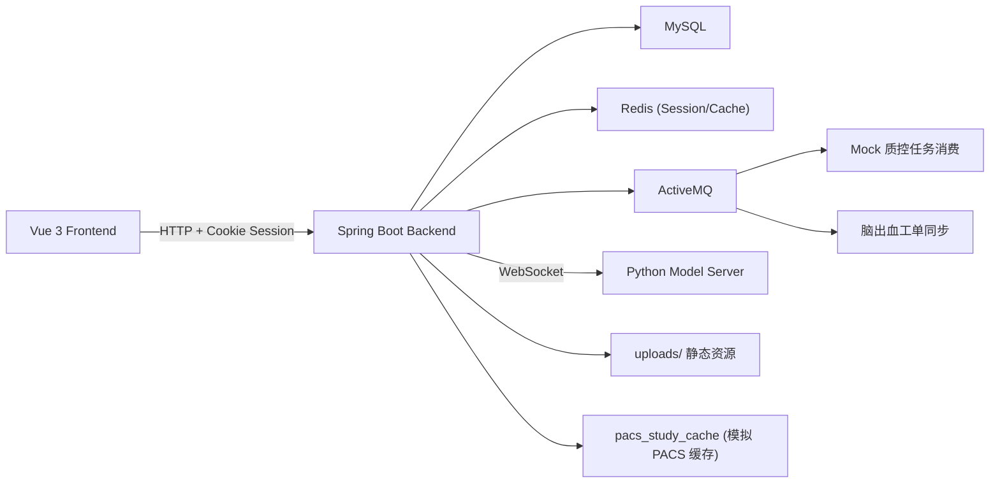
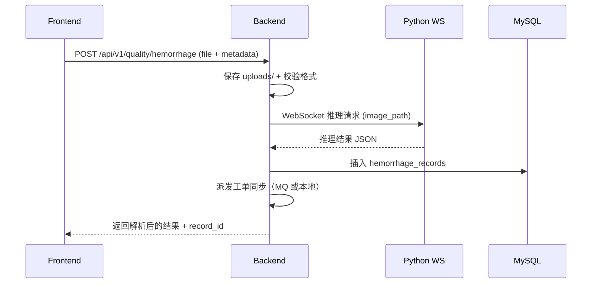
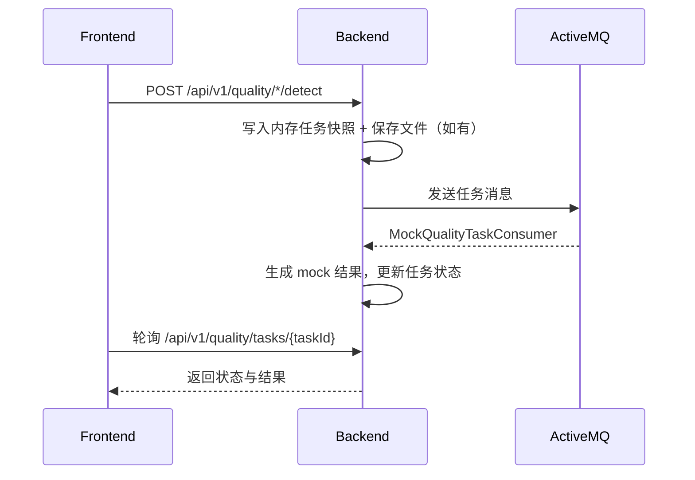
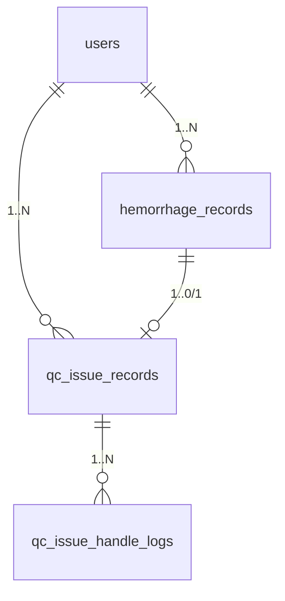

# Medical QC SYS 软件开发文档

版本：v1.0  
更新时间：2026-03-10  
适用范围：F:\Medical QC SYS（前后端 + Python 模型服务 + 数据库）

---

## 1. 文档目标

本文件用于系统性梳理 Medical QC SYS 的总体架构、功能点与数据链路，形成可用于协作开发、评审和后续扩展的统一软件开发文档。

---

## 2. 项目概述

- 业务定位：面向医学影像质控，覆盖质控任务提交、AI/Mock 分析、历史记录、异常工单与看板汇总。
- 核心功能：CT 头部脑出血 AI 检测（真实接入） + 4 个质控模块（异步任务流程已打通，结果为模拟数据）。
- 系统边界：当前偏本地 Windows 环境，ActiveMQ 与 Python 模型可自动拉起。

---

## 3. 角色与权限模型

| 角色 | 权限范围 | 说明 |
| --- | --- | --- |
| admin | 全局数据视图 | 可访问仪表盘、异常汇总、用户管理、患者信息管理 |
| doctor | 个人数据视图 | 可访问仪表盘、质控任务、异常汇总、患者信息管理 |

权限实现方式：
- Session + Redis 缓存登录态。
- `SessionUserSupport` 在每次请求时拉取最新用户数据，若角色/启停状态变更则强制重新登录。

---

## 4. 总体架构

### 4.1 组件拓扑



### 4.2 关键职责分工

**前端**
- 登录注册、角色路由、仪表盘、质控页面、异常汇总、管理员用户管理。
- 模拟质控任务轮询、PACS 演示交互、报告展示与导出提示。

**后端**
- 认证与权限校验、文件上传、静态资源映射。
- 真实脑出血检测流程、PACS 记录查询、患者信息管理。
- 异常工单生成与统计聚合。
- ActiveMQ 异步任务派发与消费。

**Python 模型服务**
- WebSocket 推理服务，处理脑出血 + 中线偏移 + 脑室异常多任务模型。

---

## 5. 代码结构与模块划分

### 5.1 后端模块（Spring Boot）

路径：`F:\Medical QC SYS\medical-qc-backend\src\main\java\com\medical\qc`

| 模块 | 说明 |
| --- | --- |
| controller | API 控制器（认证、质控、仪表盘、异常汇总、用户管理、PACS、患者信息） |
| service / service.impl | 业务逻辑实现 |
| messaging | ActiveMQ 生产/消费与消息体 |
| support | 质控异常解析、权限辅助、Mock 数据生成 |
| config | ActiveMQ/Python/Redis 配置与启动引导 |
| entity / mapper | MyBatis-Plus 实体与持久层 |

### 5.2 前端模块（Vue 3 + Vite）

路径：`F:\Medical QC SYS\medical-qc-frontend\src`

| 模块 | 说明 |
| --- | --- |
| views | 页面视图（auth、dashboard、quality、summary、admin、patient） |
| api | 后端接口封装 |
| router | 路由与权限守卫 |
| composables | 质控异步任务轮询逻辑 |
| stores / utils | 状态与请求工具 |

### 5.3 Python 模型服务

路径：`F:\Medical QC SYS\medical-qc-backend\python_model\model_server.py`  
提供 WebSocket 推理服务：`ws://localhost:8765`

---

## 6. 功能点清单（全量）

| 模块 | 功能点 | 状态 |
| --- | --- | --- |
| 认证 | 登录、注册、登出、当前会话 | 已实现 |
| 权限 | admin/doctor 分权、路由守卫 | 已实现 |
| 首页仪表盘 | 统计卡片、趋势、风险预警、活动列表 | 已实现（基于脑出血数据） |
| 脑出血检测 | 本地上传/从 PACS 拉取、AI 推理、结果回显 | 已实现 |
| 脑出血历史 | 最近记录列表、详情回显 | 已实现 |
| 异常汇总 | 统计、趋势、分布、列表、工单详情 | 已实现 |
| 异常工单 | 自动生成、状态更新、处理日志 | 已实现 |
| 质控任务（4 项） | 头部平扫/胸部平扫/胸部增强/冠脉 CTA | 半实现（模拟结果） |
| 异步任务链路 | 任务提交、MQ/线程池消费、轮询 | 已实现 |
| PACS 查询 | 缓存表多条件搜索 | 已实现（模拟） |
| 患者信息管理 | 五类患者信息 CRUD + PACS 批量同步 | 已实现 |
| 用户管理 | 用户列表、角色/状态更新 | 已实现 |
| 静态资源 | 上传文件、图片回显 | 已实现 |

---

## 7. 核心数据链路（Data Flow）

### 7.1 登录链路

1. 前端提交 `/api/v1/auth/login`（用户名/邮箱 + 密码 + 角色）。
2. 后端 `AuthServiceImpl` 校验用户、SHA-256 密码。
3. 成功后写入 Session，返回用户快照（不含密码）。

### 7.2 脑出血检测链路（本地上传）



关键落库字段：
- `hemorrhage_records.prediction/qc_status/hemorrhage_probability/...`
- `raw_result_json` 保存原始推理结果（剔除 base64）。

### 7.3 脑出血检测链路（PACS 模式）

1. 前端设置 `source_mode=pacs`，提交 `exam_id`。
2. 后端从 `pacs_study_cache` 查询记录并校验 `image_file_path`。
3. 复制 PACS 原图到 `uploads/pacs/` 以供静态访问。
4. 推理、落库、生成工单，流程与本地上传一致。

### 7.4 异常工单同步链路

1. 脑出血检测落库后调用 `HemorrhageIssueSyncDispatcher`。
2. 若 ActiveMQ 可用：发送消息到 `qc.hemorrhage.issue.sync`。
3. `HemorrhageIssueSyncConsumer` 消费并生成/更新 `qc_issue_records`。
4. 若 MQ 不可用：后端直接同步生成工单。

### 7.5 其他 4 个质控模块（异步任务链路）



说明：
- 任务快照存于内存 `ConcurrentHashMap`，重启后丢失。
- MQ 不可用时回退至本地线程池执行。

### 7.6 首页仪表盘链路

数据来源：
- `hemorrhage_records`：统计卡片、近期活动、合格率趋势。
- `qc_issue_records`：待处理任务、风险预警。

链路：
1. 前端请求 `/api/v1/dashboard/overview` + `/api/v1/dashboard/trend`。
2. 服务端聚合脑出血历史 + 异常工单数据。

### 7.7 异常汇总链路

1. 前端请求 `summary` 系列接口。
2. 后端 `IssueServiceImpl` 在查询前同步脑出血工单，保证历史数据完整。
3. 聚合返回统计、趋势、分布、分页详情。

### 7.8 患者信息管理链路

CRUD：
- `GET /api/v1/patient-info/{taskType}` 查询分页。
- `POST /api/v1/patient-info/{taskType}` 新增（必须上传影像）。
- `PUT /api/v1/patient-info/{taskType}/{id}` 更新。
- `DELETE /api/v1/patient-info/{taskType}/{id}` 删除。

PACS 同步：
- `POST /api/v1/patient-info/{taskType}/sync-from-pacs`
- 从 `pacs_study_cache` 批量匹配并复制影像至 `uploads/patient-info/<taskType>/pacs-sync/`。

### 7.9 PACS 查询链路

- `GET /api/v1/pacs/search`
  - 支持多条件过滤（患者ID/姓名/检查号/日期范围）。
  - 若存在患者信息表，则 `pacs_study_cache` 与患者信息表联查，优先输出患者主数据字段。

---

## 8. 数据模型（数据库设计）

### 8.1 核心表

| 表名 | 作用 | 关键字段 |
| --- | --- | --- |
| user_roles | 角色字典 | id, name |
| users | 用户账户 | username, email, role_id, is_active |
| hemorrhage_records | 脑出血历史 | prediction, qc_status, midline_shift, ventricle_issue, raw_result_json |
| qc_issue_records | 异常工单 | source_type, source_record_id, status, priority |
| qc_issue_handle_logs | 工单日志 | issue_id, action_type, before_status, after_status |
| pacs_study_cache | PACS 缓存 | study_instance_uid, patient_id, accession_number, image_file_path |

### 8.2 质控历史表（预建）

| 表名 | 说明 |
| --- | --- |
| head_qc_records | CT 头部平扫 |
| chest_non_contrast_qc_records | CT 胸部平扫 |
| chest_contrast_qc_records | CT 胸部增强 |
| coronary_cta_qc_records | 冠脉 CTA |

字段特征：
`qc_items_json` / `raw_result_json` 用于存储完整质控项明细与原始响应。

### 8.3 患者信息表（五张）

| 任务类型 | 表名 |
| --- | --- |
| head | head_patient_info |
| hemorrhage | hemorrhage_patient_info |
| chest-non-contrast | chest_non_contrast_patient_info |
| chest-contrast | chest_contrast_patient_info |
| coronary-cta | coronary_cta_patient_info |

通用字段：patient_id / patient_name / accession_number / gender / age / study_date / image_path。

### 8.4 表关系



---

## 9. API 规范（摘要版）

### 9.1 认证

| 方法 | 路径 | 说明 | 关键字段 |
| --- | --- | --- | --- |
| POST | /api/v1/auth/login | 登录 | username/email, password, role |
| POST | /api/v1/auth/logout | 登出 | - |
| GET | /api/v1/auth/current | 当前用户 | - |
| POST | /api/v1/auth/register | 注册 | username/email/password/fullName/hospital/department/role |

### 9.2 仪表盘

| 方法 | 路径 | 说明 |
| --- | --- | --- |
| GET | /api/v1/dashboard/overview | 统计卡片 + 风险预警 + 活动列表 |
| GET | /api/v1/dashboard/trend | 合格率趋势（period=week/month） |

### 9.3 质控（脑出血 + Mock 任务）

| 方法 | 路径 | 说明 |
| --- | --- | --- |
| POST | /api/v1/quality/hemorrhage | 脑出血检测（local/pacs） |
| GET | /api/v1/quality/hemorrhage/history | 历史列表 |
| GET | /api/v1/quality/hemorrhage/history/{id} | 历史详情 |
| POST | /api/v1/quality/head/detect | Mock 头部平扫 |
| POST | /api/v1/quality/chest-non-contrast/detect | Mock 胸部平扫 |
| POST | /api/v1/quality/chest-contrast/detect | Mock 胸部增强 |
| POST | /api/v1/quality/coronary-cta/detect | Mock 冠脉 CTA |
| GET | /api/v1/quality/tasks/{taskId} | 任务轮询 |

### 9.4 异常汇总

| 方法 | 路径 | 说明 |
| --- | --- | --- |
| GET | /api/v1/summary/stats | 统计卡片 |
| GET | /api/v1/summary/trend | 趋势 |
| GET | /api/v1/summary/distribution | 类型分布 |
| GET | /api/v1/summary/recent | 分页列表 |
| GET | /api/v1/summary/issues/{id} | 工单详情 |
| PATCH | /api/v1/summary/issues/{id}/status | 状态更新 |

### 9.5 用户管理（管理员）

| 方法 | 路径 | 说明 |
| --- | --- | --- |
| GET | /api/v1/admin/users | 用户分页 |
| PATCH/PUT | /api/v1/admin/users/{id} | 更新角色/状态 |

### 9.6 PACS 与患者信息

| 方法 | 路径 | 说明 |
| --- | --- | --- |
| GET | /api/v1/pacs/search | PACS 检索 |
| GET | /api/v1/patient-info/{taskType} | 患者信息分页 |
| POST | /api/v1/patient-info/{taskType} | 新增患者信息 |
| PUT | /api/v1/patient-info/{taskType}/{id} | 更新患者信息 |
| DELETE | /api/v1/patient-info/{taskType}/{id} | 删除患者信息 |
| POST | /api/v1/patient-info/{taskType}/sync-from-pacs | PACS 批量同步 |

### 9.7 请求/响应示例与字段约束

#### 9.7.1 通用约定

- Base URL: `/api/v1`
- 认证方式: Session + Cookie
- 错误返回: `{ "detail": "错误信息" }`
- 时间格式: `yyyy-MM-dd` 或 `yyyy-MM-dd HH:mm:ss`
- 角色枚举: `admin` / `doctor`

#### 9.7.2 登录

`POST /api/v1/auth/login`

请求:
```json
{
  "username": "doctor_a",
  "password": "******",
  "role": "doctor"
}
```

响应:
```json
{
  "id": 12,
  "username": "doctor_a",
  "fullName": "张三",
  "role": "doctor",
  "roleId": 2,
  "roleLabel": "医生"
}
```

约束:
- `username` 支持用户名或邮箱。
- `role` 必填，必须为 `admin` 或 `doctor`。

#### 9.7.3 脑出血检测（真实）

`POST /api/v1/quality/hemorrhage` (multipart/form-data)

字段:
- `file`: 本地上传文件，`source_mode=local` 时必填
- `patient_name`: 可选
- `patient_code`: 可选
- `exam_id`: PACS 模式必填
- `gender`: 可选
- `age`: 可选，必须为非负整数
- `study_date`: 可选，格式 `YYYY-MM-DD`
- `source_mode`: `local` 或 `pacs`，默认 `local`

响应:
```json
{
  "record_id": 1001,
  "prediction": "出血",
  "qc_status": "不合格",
  "primary_issue": "脑出血",
  "hemorrhage_probability": 0.93,
  "no_hemorrhage_probability": 0.07,
  "analysis_duration": 412.5,
  "image_url": "/uploads/xxx.png",
  "device": "cuda",
  "created_at": "2026-03-10 14:22:11"
}
```

约束:
- 仅支持 `.png/.jpg/.jpeg/.bmp`。
- `source_mode=pacs` 时必须提供 `exam_id` 且 PACS 缓存需存在影像路径。

#### 9.7.4 Mock 质控任务提交

`POST /api/v1/quality/head/detect` (其他三项同结构)

请求 (multipart/form-data):
- `file`: 本地上传必填
- `patient_name`: 必填
- `exam_id`: 必填
- `source_mode`: `local` / `pacs`

响应 (HTTP 202):
```json
{
  "taskId": "b8b5d9d3-9d02-4fb8-acde-07b3b9f1c4d8",
  "taskType": "head",
  "taskTypeName": "CT头部平扫质控",
  "status": "PENDING",
  "pollingUrl": "/api/v1/quality/tasks/b8b5d9d3-9d02-4fb8-acde-07b3b9f1c4d8",
  "message": "质控任务已提交，请轮询任务结果接口"
}
```

约束:
- `patient_name` 与 `exam_id` 必填。
- `source_mode` 非 `local/pacs` 会返回错误。

#### 9.7.5 Mock 任务结果查询

`GET /api/v1/quality/tasks/{taskId}`

响应:
```json
{
  "taskId": "b8b5d9d3-9d02-4fb8-acde-07b3b9f1c4d8",
  "status": "SUCCESS",
  "submittedAt": "2026-03-10 14:23:01",
  "completedAt": "2026-03-10 14:23:04",
  "result": {
    "taskType": "head",
    "patientInfo": { "name": "张三", "studyId": "EXAM-1001" },
    "qcItems": [ { "name": "扫描覆盖范围", "status": "合格" } ],
    "summary": { "totalItems": 6, "abnormalCount": 1, "qualityScore": 83, "result": "合格" }
  }
}
```

状态枚举:
- `PENDING` / `PROCESSING` / `SUCCESS` / `FAILED`

#### 9.7.6 工单状态更新

`PATCH /api/v1/summary/issues/{issueId}/status`

请求:
```json
{
  "status": "处理中",
  "remark": "已通知复核"
}
```

约束:
- `status` 仅允许 `待处理` / `处理中` / `已解决`。

#### 9.7.7 患者信息新增

`POST /api/v1/patient-info/{taskType}` (multipart/form-data)

字段:
- `patient_name`: 必填
- `accession_number`: 必填
- `image_file`: 必填
- `gender/age/study_date/remark`: 可选

响应:
```json
{
  "data": {
    "id": 21,
    "patientName": "李四",
    "accessionNumber": "ACC-1002",
    "imagePath": "uploads/patient-info/head/xxx.png"
  }
}
```

#### 9.7.8 PACS 查询

`GET /api/v1/pacs/search`

查询参数:
- `task_type`: head/hemorrhage/chest-non-contrast/chest-contrast/coronary-cta
- `patient_id` / `patient_name` / `accession_number`
- `start_date` / `end_date` (YYYY-MM-DD)

响应:
```json
{
  "data": [
    { "patientName": "王五", "accessionNumber": "PACS-001", "studyDate": "2026-03-01" }
  ]
}
```

---

## 10. 前端页面与路由

| 路由 | 页面 | 权限 | 说明 |
| --- | --- | --- | --- |
| /login | 登录 | 公开 | 登录与角色切换 |
| /register | 注册 | 公开 | 用户注册 |
| /dashboard | 仪表盘 | admin/doctor | 质控统计 + 风险预警 |
| /hemorrhage | 脑出血检测 | doctor | 真实 AI |
| /head | CT 头部平扫 | doctor | Mock 异步任务 |
| /chest-non-contrast | CT 胸部平扫 | doctor | Mock 异步任务 |
| /chest-contrast | CT 胸部增强 | doctor | Mock 异步任务 |
| /coronary-cta | 冠脉 CTA | doctor | Mock 异步任务 |
| /issues | 异常汇总 | admin/doctor | 工单视图 |
| /admin/users | 用户管理 | admin | 角色/启停 |
| /patient-info/* | 患者信息管理 | admin/doctor | 五类患者信息维护 |
| /forbidden | 无权限 | 已登录 | 权限拦截页 |

---

## 11. 关键配置与运行环境

后端核心配置（`application.properties`）：
- 数据库：`spring.datasource.*`
- Redis：`spring.data.redis.*`
- ActiveMQ：`spring.activemq.*` + `app.messaging.activemq.*`
- Python 模型服务：`python.model_server.url`
- 自动启动：`python.model.autostart` / `app.messaging.activemq.autostart`

依赖环境：
`JDK 17` / `MySQL 8` / `Redis 6+` / `ActiveMQ 5.16+` / `Python 3.10+` / `CUDA`

---

## 12. 已知限制与风险

- 脑出血模型强依赖 CUDA，未启用 GPU 时无法执行真实推理。
- 4 个质控模块仍为 Mock，任务状态不持久化。
- PACS 目前为模拟缓存表，真实 DICOM 查询尚未接入。
- ActiveMQ 不可用时任务自动回退为本地线程池执行。

---

## 13. 扩展建议

1. 将 Mock 质控任务接入真实算法服务，并落库到预建历史表。
2. 将任务快照迁移至 Redis/数据库，支持重启恢复。
3. 接入 DICOM 解析与 PACS 真实拉取链路。
4. 前端进一步 TypeScript 化并抽象质控页面组件。

---

## 14. 参考文件

- `F:\Medical QC SYS\README.md`
- `F:\Medical QC SYS\docs\dashboard-summary-data-model.md`
- `F:\Medical QC SYS\medical-qc-backend\src\main\resources\sql\*.sql`
